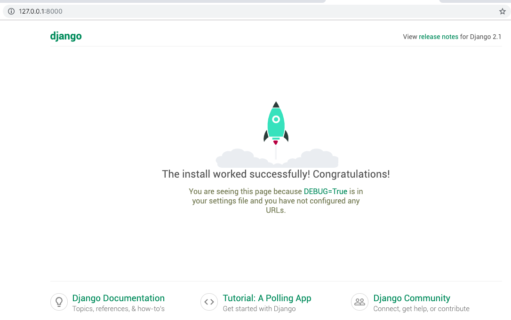

=====================================
Writing your first Django app, part 1
=====================================

* Django Getting started, `part 1 <https://docs.djangoproject.com/en/2.1/intro/tutorial01/>`_
* Read The Docs, `part 1 <https://django21-tutorial-lab.readthedocs.io/en/latest/intro/tutorial01.html>`_
 
  
1-1. Virtual Envrionment
==================

Lab::

    $ python3.6 -v venv venv 
    $ source venv/bin/activate 
    (venv)$ pip install django  
    

.. note::
    $ which python, to ensure which virtual envrionment you're using. 
    
 
    
1-2. Start Project
==================

Lab::

    (venv)$ django-admin startproject mysite
    (venv)$ cd mysite
    (venv)$ python manage.py runserver

.. note::
    http://127.0.0.1:8000, to see a rocket!

1-3. Start App
==================

.. warning::
    You can keep one terminal with 'python manage.py runserver' and use a new terminal to 'python manage.py startapp polls'.
    Or you can 'Quit the server with CONTROL-C' and source go to run server in a script. We will add more commands to script     go. 
 
Lab::

    (venv)$ python manage.py startapp polls
    *** edit mysite/urls.py    
    *** add polls/urls.py
    *** edit polls/views.py
    *** add go.py
    (venv)$ . go
    
    
   
    
    
    
* mysite/urls.py::
    
    
    from django.contrib import admin
    from django.urls import path,include

    urlpatterns = [
        path('admin/', admin.site.urls),
        path('polls/', include('polls.urls')),
    ]

* polls/urls.py::
    
    
    from django.urls import path
    from . import views

    urlpatterns = [
      path('', views.index, name='index'),
    ]

* polls/views.py::
    

    from django.http import HttpResponse    
    def index(request):
        return HttpResponse("Hello, world. You're at the polls index.")

* go::
    

    python manage.py runserver

    

.. note::
    To ensure  http://127.0.0.1:8000/polls/ is working.

.. figure:: _static/img1-3_01.png
    :align: center

.. warning::
    Be aware http://127.0.0.1:8000 is damaged!
    
.. figure:: _static/img1-3_02.png
    :align: center

