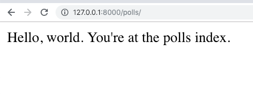

=====================================
Writing your first Django app, part 1
=====================================

 Django `Getting started <https://docs.djangoproject.com/en/2.1/intro/tutorial02/>`_

 This page on `Read The Docs <https://django21-tutorial-lab.readthedocs.io/en/latest/intro/tutorial02.html/>`_
 
  
1-1. Prepare Lab Virtual Envrionment
==================

Lab::

    $ python3.6 -v venv venv 
    $ source venv/bin/activate 
    (venv)$ pip install django  
    

.. note::
    $ pip freeze, to see installed packages.
    $ which python, to ensure which virtual envrionment you're using. 
    
 
    
1-2. Start Project and Run Development Server
==================

Lab::

    (venv)$ django-admin startproject mysite
    (venv)$ cd mysite
    (venv)$ python manage.py runserver
    *** Use browser to visit 127.0.0.1:8000

.. note::
    You should see a rocket on the page.

1-3. Start App and Maintain View and URLs
==================

Lab::

    $ python manage.py startapp polls
    *** edit mysite/urls.py    
    *** new polls/urls.py
    *** add def index to polls/views.py
    (venv)$ python manage.py runserver
    *** browser, visit 127.0.0.1:8000/polls
    
    
* mysite/urls.py::
    
    
    from django.contrib import admin
    from django.urls import path,include

    urlpatterns = [
        path('admin/', admin.site.urls),
        path('polls/', include('polls.urls')),
    ]

* polls/urls.py::
    
    
    from django.urls import path
    from . import views

    urlpatterns = [
      path('', views.index, name='index'),
    ]

* polls/views.py::
    

    from django.http import HttpResponse    
    def index(request):
        return HttpResponse("Hello, world. You're at the polls index.")

    

.. note::
    To ensure polls is working.

.. warning::
    Be aware 127.0.0.1:8000 is damaged!
    

