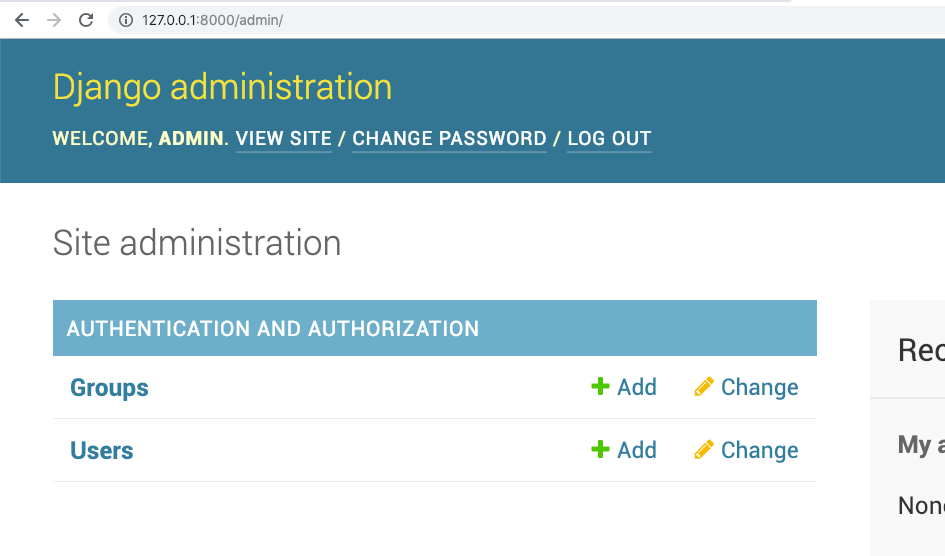
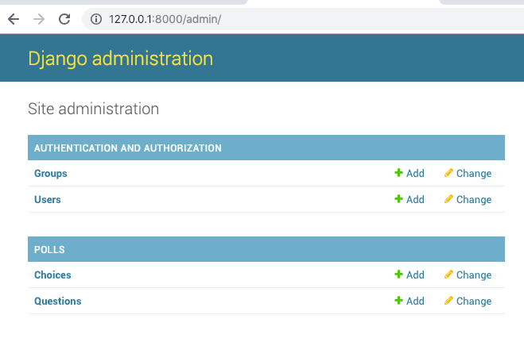
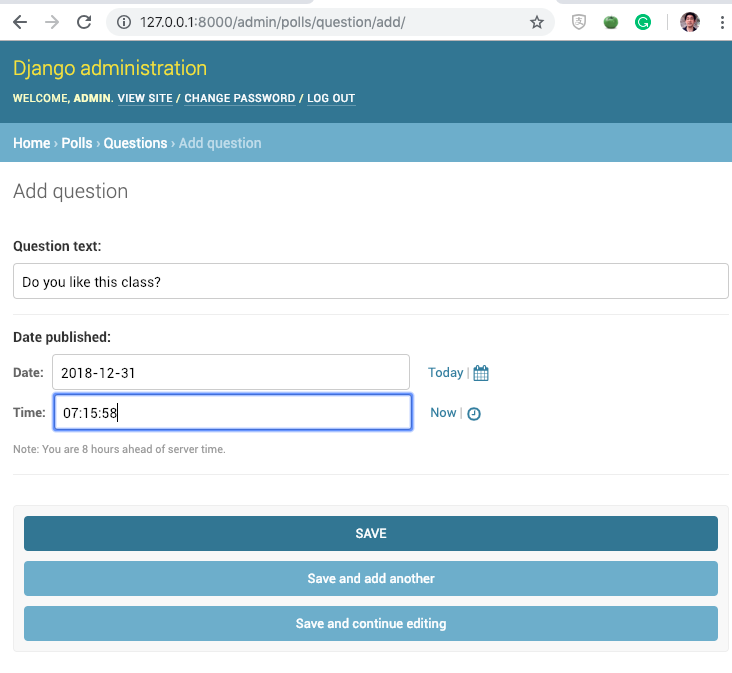
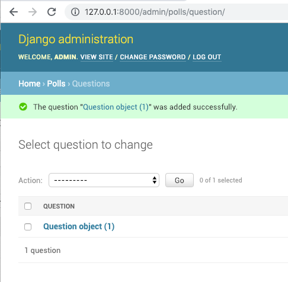
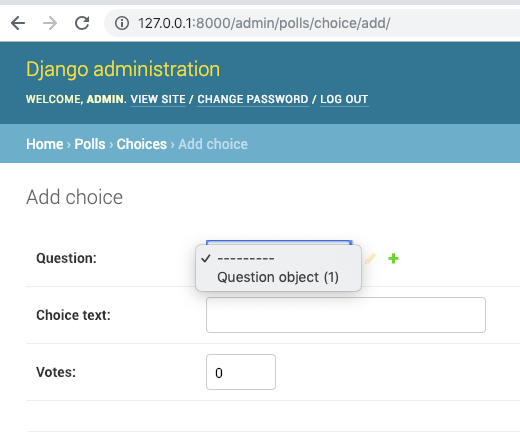
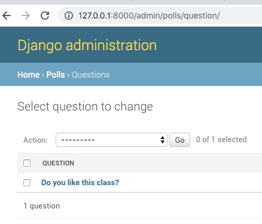
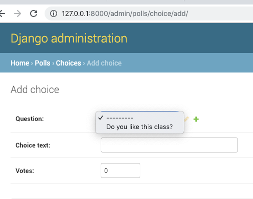
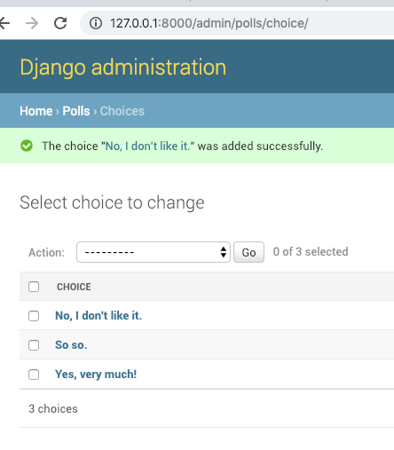

=====================================
Writing your first Django app, part 2
=====================================

* Django Getting started, `part 2 <https://docs.djangoproject.com/en/2.1/intro/tutorial02/>`_
* Read The Docs, `part 2 <https://django21-tutorial-lab.readthedocs.io/en/latest/intro/tutorial02.html>`_
  
2-1. Admin
==================

Lab::

    (venv)$ python manage.py migrate 
    (venv)$ python manage.py createsuperuser
    (venv)$ . go
 
.. note::
    http://127.0.0.1:8000/admin/, login to check user/group.
    

    

.. note::
    Able to use Django Admin. 
 

    
2-2. Model 
==================

Lab::

    *** edit mysite/settings.py
    *** edit poll/models.py
    *** edit poll/admin.py 
    *** edit go
    . go

* mysite/settings.py::

   
   INSTALLED_APPS = [
      'polls',
      'django.contrib.admin',
      ...
    

* polls/models.py::

    from django.db import models

    class Question(models.Model):
        question_text = models.CharField(max_length=200)
        pub_date = models.DateTimeField('date published')

    class Choice(models.Model):
        question = models.ForeignKey(Question, on_delete=models.CASCADE)
        choice_text = models.CharField(max_length=200)
        votes = models.IntegerField(default=0)

* polls/admin.py::

   from django.contrib import admin
   from .models import Question,Choice
   admin.site.register(Question)
   admin.site.register(Choice)

* go.py::

   python manage.py makemigrations
   python manage.py migrate
   python manage.py runserver
 

    

    

.. note::
    Able to use Django Admin to add/edit Question and Choice. 
 
.. warning::
    TODO: Turn 'Question object(1)' to be user-friendly.
 
 
2-3. __str__
==================

Lab::

 
    *** edit poll/models.py
   

* polls/models.py::

    from django.db import models

    class Question(models.Model):
        question_text = models.CharField(max_length=200)
        pub_date = models.DateTimeField('date published')
        def __str__(self):
            return self.question_text

    class Choice(models.Model):
        question = models.ForeignKey(Question, on_delete=models.CASCADE)
        choice_text = models.CharField(max_length=200)
        votes = models.IntegerField(default=0)
        def __str__(self):
            return self.choice_text

    

    

.. note::
    For this case, you don't need to stop and start server again. Developing environment do it for you. 
 
.. warning::
    TODO: When you have more than one question, you might want to show Question on Choice list as well.
 
 
