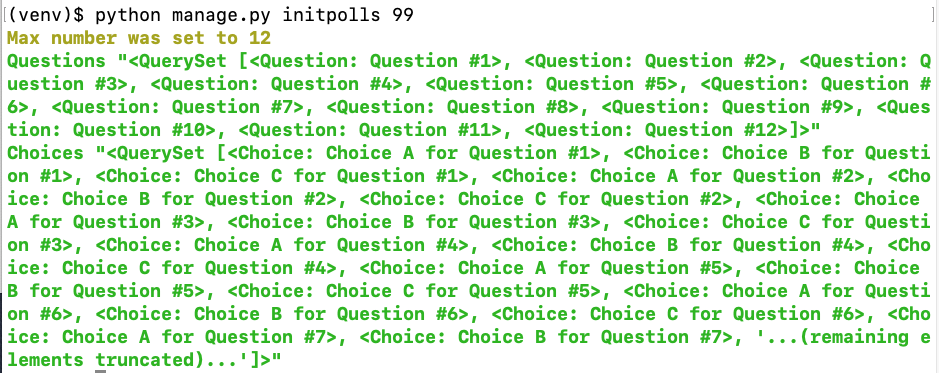
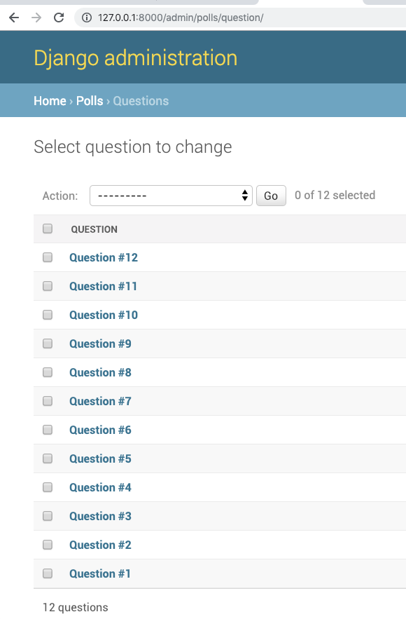
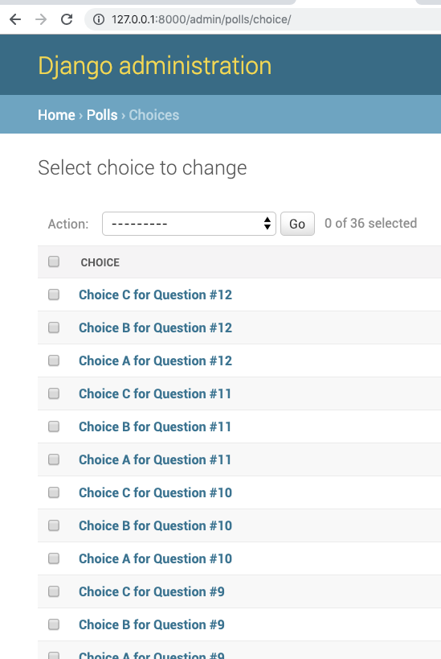

=====================================
Writing your first Django app, part 2
=====================================

* Django Getting started, `part 2 <https://docs.djangoproject.com/en/2.1/intro/tutorial02/>`_
* Writing custom `django-admin commands  <https://docs.djangoproject.com/en/2.1/howto/custom-management-commands/>`_

* Read The Docs, `part 2 <https://django21-tutorial-lab.readthedocs.io/en/latest/intro/tutorial02.html>`_
  
2-1. Admin
==================

Lab::

    (venv)$ python manage.py migrate 
    (venv)$ python manage.py createsuperuser
    (venv)$ . go
 
.. note::
    http://127.0.0.1:8000/admin/, login to maintain user/group.
    
.. figure:: _static/img2-1-1.png
    :align: center

    
    

    
2-2. Model 
==================

Lab::

    *** edit mysite/settings.py
    *** edit poll/models.py
    *** edit poll/admin.py 
    *** edit go
    . go

* mysite/settings.py::

   
   INSTALLED_APPS = [
      'polls',
      'django.contrib.admin',
      ...
    

* polls/models.py::

    from django.db import models

    class Question(models.Model):
        question_text = models.CharField(max_length=200)
        pub_date = models.DateTimeField('date published')
        def __str__(self):
            return self.question_text

    class Choice(models.Model):
        question = models.ForeignKey(Question, on_delete=models.CASCADE)
        choice_text = models.CharField(max_length=200)
        votes = models.IntegerField(default=0)
        def __str__(self):
            return self.choice_text

* polls/admin.py::

   from django.contrib import admin
   from .models import Question,Choice
   admin.site.register(Question)
   admin.site.register(Choice)

* go.py::

   python manage.py makemigrations
   python manage.py migrate
   python manage.py runserver
 

.. note::
    Able to maintain Question and Choice. 
 

    

    
    
2-3. Command 
==================

Lab::

    *** add polls/management/commands/initpolls.py
    python manage.py
    python manage.py initpolls
    . go
    

 
* polls/management/commands/initpolls.py::

    from django.core.management.base import BaseCommand, CommandError
    from polls.models import Question,Choice
    from django.utils import timezone

    class Command(BaseCommand):
        help = 'Create sample questions and choices.'

        def add_arguments(self, parser):
            parser.add_argument('question_num',type=int)

        def handle(self, *args, **options):
            q = Question.objects.all()
            q.delete()

            cnt = 0
            question_num = options['question_num']
            while (cnt < question_num):
                cnt += 1
                if cnt > 12:
                    self.stdout.write(self.style.WARNING('Max number was set to 12'))
                    break
                q = Question(question_text="Question #"+str(cnt),pub_date=timezone.now())
                q.save()
                q.choice_set.create(choice_text='Choice A for Question #'+str(cnt),votes=0)
                q.choice_set.create(choice_text='Choice B for Question #'+str(cnt),votes=0)
                q.choice_set.create(choice_text='Choice C for Question #'+str(cnt),votes=0)

            q = Question.objects.all()
            c = Choice.objects.all()

            self.stdout.write(self.style.SUCCESS('Questions "%s"' % q))
            self.stdout.write(self.style.SUCCESS('Choices "%s"' % c))

 

.. figure:: _static/img2-3-1.png
    :align: center

 

    

