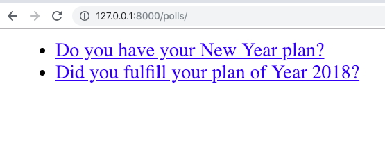
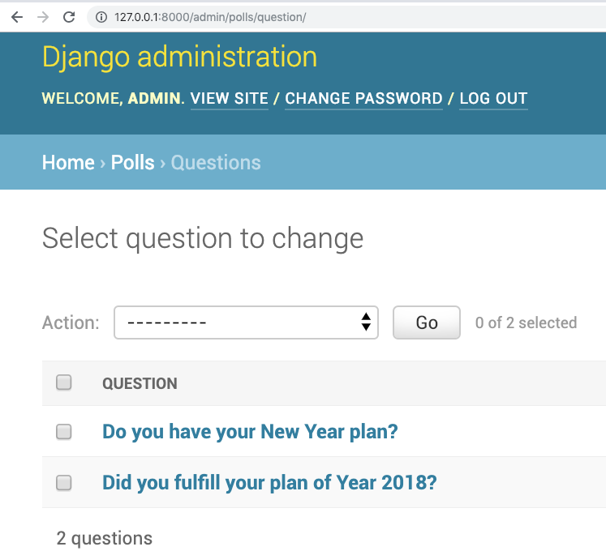

=====================================
Writing your first Django app, part 3
=====================================

* Django Getting started, `part 3 <https://docs.djangoproject.com/en/2.1/intro/tutorial03/>`_
* Read The Docs, `part 3 <https://django21-tutorial-lab.readthedocs.io/en/latest/intro/tutorial03.html>`_
  

    
3-1. Polls Index 
==================

Lab::

    *** edit polls/views.py
    *** add polls/templates/polls/index.html

* polls/views.py::

    from django.shortcuts import render
    from .models import Question

    def index(request):
        latest_question_list = Question.objects.order_by('-pub_date')[:5]
        context = {'latest_question_list': latest_question_list}
        return render(request, 'polls/index.html', context)
        
        
* polls/templates/polls/index.html::
    
      <ul>
      
        <li><a href="/polls/{{ question.id }}/">{{ question.question_text }}</a></li>
      
      </ul>
    
      
No polls are available.

     
        

    

.. note::
    Admin vs. customized page. 
 

 

 
 
