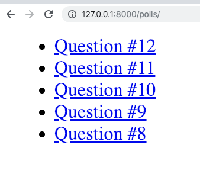
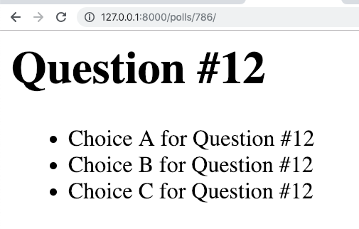

=====================================
Writing your first Django app, part 3
=====================================
References:

* Django Getting started, `part 3 <https://docs.djangoproject.com/en/2.1/intro/tutorial03/>`_
* Django Grils Tutorial, `STATIC_ROOT <https://tutorial.djangogirls.org/en/django_start_project/#changing-settings>`_

* Django , `Django import / export <https://django-import-export.readthedocs.io/>`_

Hosting:

* Read The Docs, `part 3 <https://django21-tutorial-lab.readthedocs.io/en/latest/intro/tutorial03.html>`_
  

    
3-1. Polls Index 
==================

Lab::

    *** edit polls/views.py
    *** add polls/templates/polls/index.html

* polls/views.py::

    from django.shortcuts import render
    from .models import Question

    def index(request):
        latest_question_list = Question.objects.order_by('-pub_date')[:5]
        context = {'latest_question_list': latest_question_list}
        return render(request, 'polls/index.html', context)
        
        
* polls/templates/polls/index.html::

    
      <ul>
      
        <li><a href="/polls/{{ question.id }}/">{{ question.question_text }}</a></li>
      
      </ul>
    
      
No polls are available.

     
        

    

 

.. note::
    Show questions on our polls page. 
 

3-2. Polls Detail 
==================

Lab::

    *** edit polls/urls.py
    *** edit polls/models.py
    *** edit polls/views.py
    *** edit polls/templates/polls/index.html
    *** add polls/templates/polls/detail.html
    . go

* polls/urls.py::

    from django.urls import path
    from . import views
    app_name = 'polls'

    urlpatterns = [
      path('', views.index, name='index'),
      path('<int:question_id>/', views.detail, name='detail')
    ]

* polls/models.py::

    from django.db import models

    class Question(models.Model):
        question_text = models.CharField(max_length=200)
        pub_date = models.DateTimeField('date published')
        def __str__(self):
            return self.question_text

    class Choice(models.Model):
        question = models.ForeignKey(Question, on_delete=models.CASCADE)
        choice_text = models.CharField(max_length=200)
        votes = models.IntegerField(default=0)
        def __str__(self):
            return self.question.question_text+" "+self.choice_text

* polls/views.py::

    from django.shortcuts import render,get_object_or_404
    from .models import Question

    def index(request):
        latest_question_list = Question.objects.order_by('-pub_date')[:5]
        context = {'latest_question_list': latest_question_list}
        return render(request, 'polls/index.html', context)

    def detail(request, question_id):
        question = get_object_or_404(Question, pk=question_id)
        return render(request, 'polls/detail.html', {'question': question})

        
        
* polls/templates/polls/index.html::

    
      <ul>
      
        <li><a href="">{{ question.question_text }}</a></li>
      
      </ul>
    
      
No polls are available.

    
        
* polls/templates/polls/detail.html::

    <h1>{{ question.question_text }}</h1>
    <ul>
    
        <li>{{ choice.choice_text }}</li>
    
    </ul>
        

    
.. figure:: _static/img3-2-2.png
    :align: center
 

.. note::
    Also modify Choice's __str__ 
 

3-3. Django import / export
==================

Lab::

    pip install django-import-export
    pip freeze
    *** edit mysite/setting.py
    *** edit polls/admin.py
    . go 

 .. figure:: _static/img3-3-1.png
    :align: center
    
.. figure:: _static/img3-3-2.png
    :align: center
 
 
