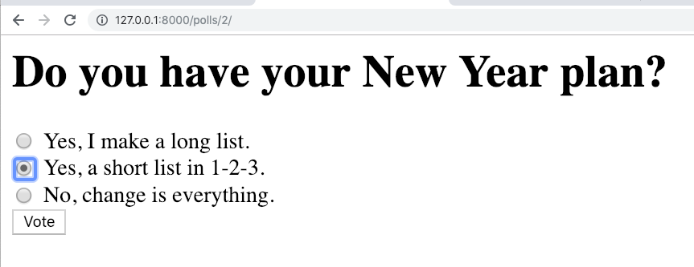
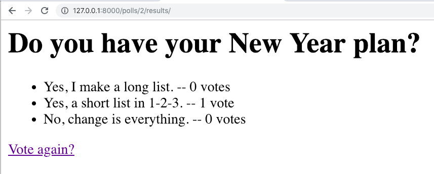

=====================================
Writing your first Django app, part 4
=====================================

* Django Getting started, `part 4 <https://docs.djangoproject.com/en/2.1/intro/tutorial04/>`_
* Read The Docs, `part 4 <https://django21-tutorial-lab.readthedocs.io/en/latest/intro/tutorial04.html>`_
  

    
3-1. Forms 
==================

Lab::

    *** edit polls/urls.py
    *** edit polls/views.py
    *** add polls/templates/polls/detail.html
    . go

* polls/urls.py::

    from django.urls import path
    from . import views
    app_name = 'polls'

    urlpatterns = [
      path('', views.index, name='index'),
      path('<int:question_id>/', views.detail, name='detail')
    ]

* polls/models.py::

    from django.db import models

    class Question(models.Model):
        question_text = models.CharField(max_length=200)
        pub_date = models.DateTimeField('date published')
        def __str__(self):
            return self.question_text

    class Choice(models.Model):
        question = models.ForeignKey(Question, on_delete=models.CASCADE)
        choice_text = models.CharField(max_length=200)
        votes = models.IntegerField(default=0)
        def __str__(self):
            return self.question.question_text+" "+self.choice_text

* polls/views.py::

    from django.shortcuts import render,get_object_or_404
    from .models import Question

    def index(request):
        latest_question_list = Question.objects.order_by('-pub_date')[:5]
        context = {'latest_question_list': latest_question_list}
        return render(request, 'polls/index.html', context)

    def detail(request, question_id):
        question = get_object_or_404(Question, pk=question_id)
        return render(request, 'polls/detail.html', {'question': question})

        
        

        
* polls/templates/polls/detail.html::
    <h1>{{ question.question_text }}</h1>

    
<strong>{{ error_message }}</strong>


    <form action="" method="post">
    
    
        <input type="radio" name="choice" id="choice{{ forloop.counter }}" value="{{ choice.id }}">
        <label for="choice{{ forloop.counter }}">{{ choice.choice_text }}</label> 
    
    <input type="submit" value="Vote">
    </form>
        

    

 

.. note::
    Able to vote
 

 

 
 
