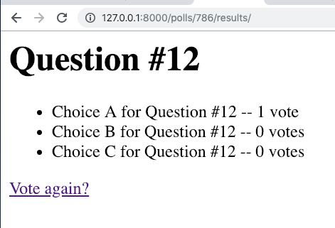

=====================================
Writing your first Django app, part 4
=====================================

* Django Getting started, `part 4 <https://docs.djangoproject.com/en/2.1/intro/tutorial04/>`_
* Read The Docs, `part 4 <https://django21-tutorial-lab.readthedocs.io/en/latest/intro/tutorial04.html>`_
  

    
4-1. Forms 
==================

Lab::

    *** edit polls/urls.py
    *** edit polls/views.py
    *** edit polls/templates/polls/detail.html
    *** add polls/templates/polls/vote.html
    *** add polls/templates/polls/result.html
    . go

* polls/urls.py::

    from django.urls import path
    from . import views
    app_name = 'polls'

    urlpatterns = [
      path('', views.index, name='index'),
      path('<int:question_id>/', views.detail, name='detail'),
      path('<int:question_id>/vote/', views.vote, name='vote'),
      path('<int:question_id>/results/', views.results, name='results'),
    ]

* polls/views.py::

    from django.http import HttpResponse, HttpResponseRedirect
    from django.shortcuts import get_object_or_404, render
    from django.urls import reverse

    from .models import Choice, Question

    def index(request):
        latest_question_list = Question.objects.order_by('-pub_date')[:5]
        context = {'latest_question_list': latest_question_list}
        return render(request, 'polls/index.html', context)

    def detail(request, question_id):
        question = get_object_or_404(Question, pk=question_id)
        return render(request, 'polls/detail.html', {'question': question})

    def vote(request, question_id):
        question = get_object_or_404(Question, pk=question_id)
        try:
            selected_choice = question.choice_set.get(pk=request.POST['choice'])
        except (KeyError, Choice.DoesNotExist):
            # Redisplay the question voting form.
            return render(request, 'polls/detail.html', {
                'question': question,
                'error_message': "You didn't select a choice.",
            })
        else:
            selected_choice.votes += 1
            selected_choice.save()
            # Always return an HttpResponseRedirect after successfully dealing
            # with POST data. This prevents data from being posted twice if a
            # user hits the Back button.
            return HttpResponseRedirect(reverse('polls:results', args=(question.id,)))

    def results(request, question_id):
        question = get_object_or_404(Question, pk=question_id)
        return render(request, 'polls/results.html', {'question': question})

        
        

        
* polls/templates/polls/detail.html::

    <h1>{{ question.question_text }}</h1>

    
<strong>{{ error_message }}</strong>


    <form action="" method="post">
    
    
        <input type="radio" name="choice" id="choice{{ forloop.counter }}" value="{{ choice.id }}">
        <label for="choice{{ forloop.counter }}">{{ choice.choice_text }}</label> 
    
    <input type="submit" value="Vote">
    </form>
        

* polls/templates/polls/results.html::

    <h1>{{ question.question_text }}</h1>

    <ul>
    
        <li>{{ choice.choice_text }} -- {{ choice.votes }} vote{{ choice.votes|pluralize }}</li>
    
    </ul>

    <a href="">Vote again?</a>

    

 

.. note::
    Able to vote
 

 

 
 
