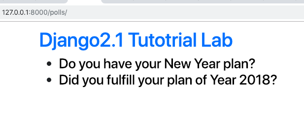
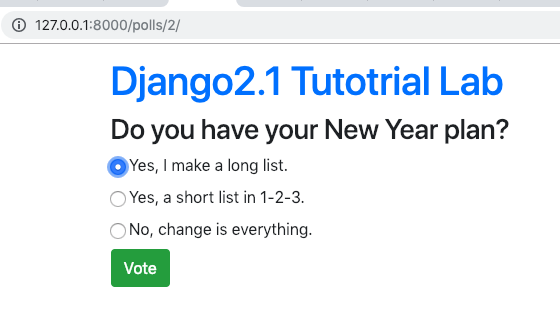
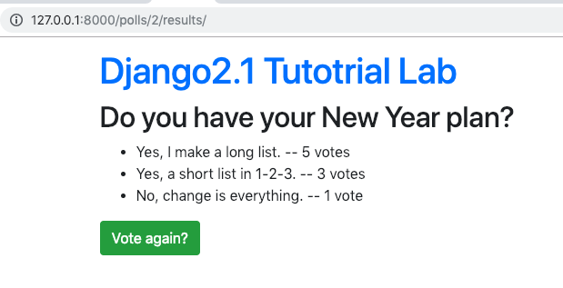

=====================================
Writing your first Django app, part 6
=====================================

* Django Getting started, `part 6 <https://docs.djangoproject.com/en/2.1/intro/tutorial06/>`_
* Django Girls Tutorials, `Template extending <https://tutorial.djangogirls.org/en/template_extending/>`_
* Boostrap v4.2, `Starter template <https://getbootstrap.com/docs/4.2/getting-started/introduction/>`_

* Read The Docs, `part 6 <https://django21-tutorial-lab.readthedocs.io/en/latest/intro/tutorial06.html>`_
  

    
6-1. Test 
==================

Lab::

    *** edit polls/static/polls/style.css
    *** add polls/templates/base.html
    *** edit polls/templates/index.html
    *** edit polls/templates/detail.html
    *** edit polls/templates/results.html
    (venv)$ python manage.py test

* polls/static/polls/style.css::

    body{
      margin-top: 12px;
    }

    li a {
        color: black;
    }

* polls/templates/base.html::

    
    <!doctype html>
    <html lang="en">
      <head>
        <!-- Required meta tags -->
        <meta charset="utf-8">
        <meta name="viewport" content="width=device-width, initial-scale=1, shrink-to-fit=no">

        <!-- Bootstrap CSS -->
        <link rel="stylesheet" href="https://stackpath.bootstrapcdn.com/bootstrap/4.2.1/css/bootstrap.min.css" integrity="sha384-GJzZqFGwb1QTTN6wy59ffF1BuGJpLSa9DkKMp0DgiMDm4iYMj70gZWKYbI706tWS" crossorigin="anonymous">
        <link rel="stylesheet" type="text/css" href="">
        <title>Lab</title>
      </head>
      <body>
        

          <h1><a href='/polls/'>Django2.1 Tutotrial Lab</a></h1>
              

                

                
                
                

            

        

        <!-- Optional JavaScript -->
        <!-- jQuery first, then Popper.js, then Bootstrap JS -->
        
        
        
      </body>
    </html>

        
* polls/templates/index.html::

    
    

    
      <h3><ul>
      
        <li><a href="">{{ question.question_text }}</a></li>
      
    </ul></h3>
    
      
No polls are available.

    
    
  
        
* polls/templates/detail.html::

    
    
    <h3>{{ question.question_text }}</h3>

    
<strong>{{ error_message }}</strong>


    <form action="" method="post">
    
    
        <input type="radio" name="choice" id="choice{{ forloop.counter }}" value="{{ choice.id }}">
        <label for="choice{{ forloop.counter }}">{{ choice.choice_text }}</label> 
    
    <input class='btn btn-success' type="submit" value="Vote">
    </form>
    

* polls/templates/results.html::

    
    
    <h2>{{ question.question_text }}</h2>

    <ul>
    
        <li>{{ choice.choice_text }} -- {{ choice.votes }} vote{{ choice.votes|pluralize }}</li>
    
    </ul>

    <a class='btn btn-success' href="">Vote again?</a>
    

    

    

    

.. warning::
    You might need to 'Clear Browsing Data' to let css working during development.
 

 

 
 
