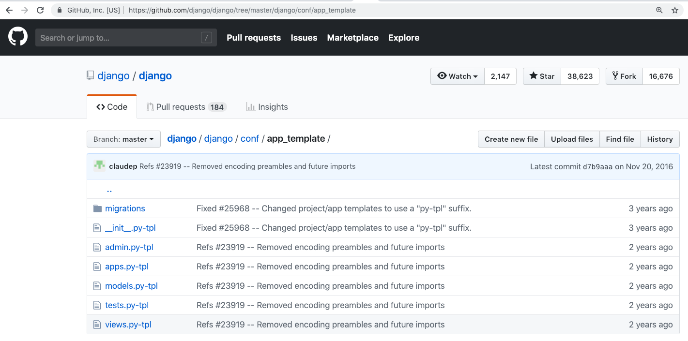

==================
My desired startapp
==================

References:

* Django ref, `django-admin and manage.py <https://docs.djangoproject.com/en/2.1/ref/django-admin/>`_

python manage.py startapp

根據個人的開發經驗，urls.py, templates/{{app_name}}/base.html, 總是會用到的，為什麼不預設就有呢？

從文檔和代碼看目前做法

模版

What's standard startapp doing?
==================

111
---
create the folder

222
----
copy files

333
---
replace variable with app name 
